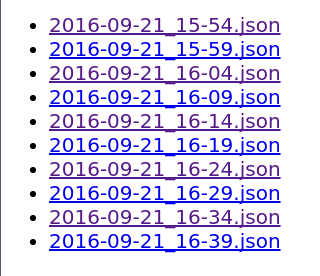

# youbike

## Installation

```bash
  $ pip install -r requirements.txt
  # or
  $ make install
```

## Configuration

Please edit `SETTINGS.PY`

- `YOUBIKE_DATA_URL` *(default = 'http://data.taipei/youbike')*
- `SAVE_FILE_DIR` *(default = os.path.join(BASE_DIR, 'UB_DATA'))*

## Usage

### download script
``` bash
  $ make download
```

### simple views server
``` bash
  $ make server
```


**byDocker**

```bash
$ sudo docker build . -t ub
$ sudo docker run -d -p 8888:8888 -v /etc/localtime:/etc/localtime:ro -v /home/{User}/ub_data:/opt/app/data ub
```
